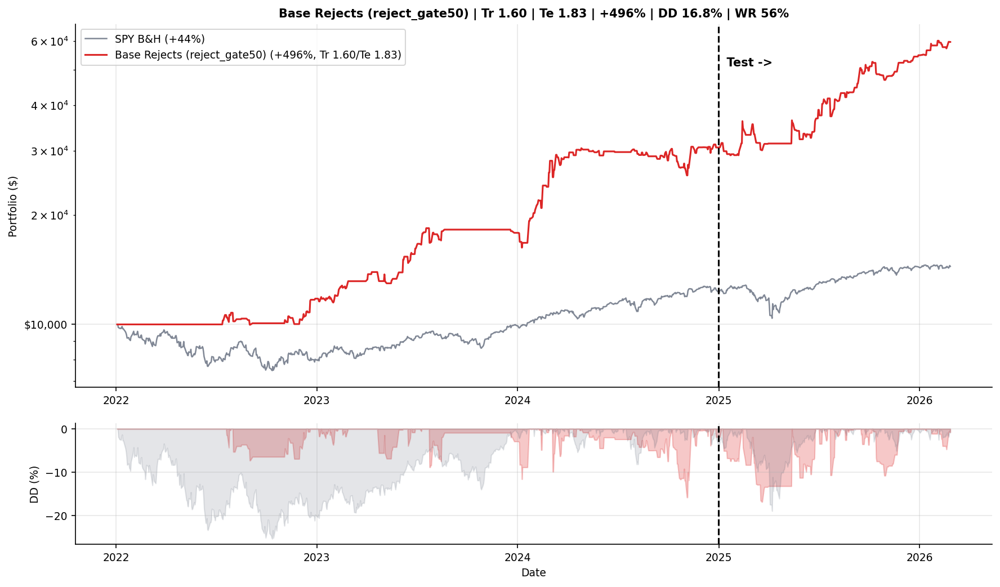
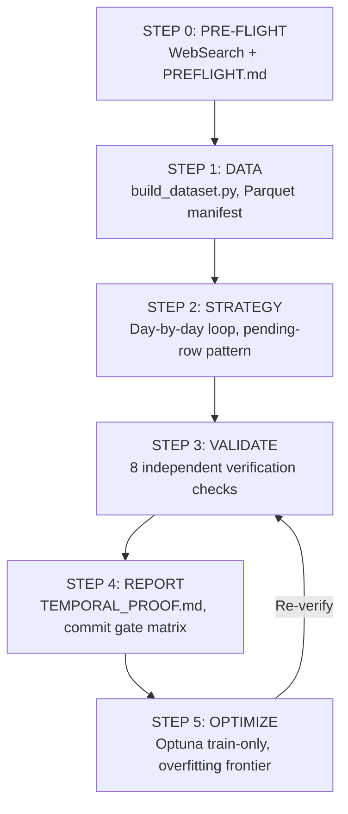

# Alphadidactic

An iteration research agent: searches academic research, applies it to time series data, and probes it to find novel discoveries.

Claude Code instructions—not hand-written strategies—build, verify, and optimize quantitative experiments through a gated pipeline. Each step must pass before the next begins: literature search, dataset construction, strategy implementation, independent verification, and parameter optimization.

## The Two Rules

1. **All data used to produce a signal must exist before the position it triggers is entered or exited. Future data is not allowed to enter the system.**
2. **All optimization and parameter tuning use only training data. Out-of-sample test data that was never trained on is the real measure of whether a signal generalizes.**

**Everything else is up to Claude.**



## The Loop

Three agents—experiment, reviewer, adversary—cycle on every experiment. Shared infrastructure makes entire bug classes impossible by construction rather than relying on instructions the agent might skip. Every iteration that exposes a gap in the instructions gets patched immediately—the instruction set evolves through failure, not design.

## The Hard Problems

Bugs in quantitative research don't crash—they produce beautiful equity curves. A same-day return pairing or a dropped timezone conversion inflates Sharpe by 1–2 points and passes every naive check. The most dangerous variant is a self-referential audit: we built an honesty audit around a strategy with a test Sharpe of 3.9, and the audit itself had the same causal error it was supposed to detect.

## Experiment Pipeline

The build pipeline enforces a strict 5-step protocol: PRE-FLIGHT (literature search and hypothesis documentation), DATA (dataset construction with single-day query bounds and shared infrastructure), STRATEGY (day-by-day loop implementation using the pending-row pattern with mandatory statistical robustness tests), VALIDATE (8 independent verification checks including incremental-vs-batch replication at 1e-8 tolerance), and OPTIMIZE (Optuna parameter search on train data only, with baseline comparison and overfitting frontier analysis). Each step is gated — the pipeline will not advance until all mandatory checks pass, and every experiment produces a complete temporal proof with wall-clock diagrams, audit tables, and a commit gate matrix that both the experiment agent and reviewer must agree on before code is merged.



## Data

Market data is sourced from [Massive Flat Files](https://massive.com/docs/flat-files/quickstart) — compressed CSV files covering US stocks, options, indices, forex, and crypto, delivered via an S3-compatible endpoint. Data for each trading day is available by approximately 11:00 AM ET the following day. It is stored locally in TimescaleDB with native compression enabled.

## Getting Started

**1. Start the database.**

```bash
docker compose up -d
```

**2. Import data from Massive Flat Files.**

Import the CSV files into TimescaleDB, making sure to enable compression on the timeseries hypertables. The import and compression scripts are not included in this repo.

**3. Run an experiment.**

`CLAUDE.md`, the agents, and the skills already know what to do. Just type a prompt:

```text
Fixing a bug in how the code handles stock splits and noticed something interesting —
inverse ETF splits didn't change the backtest at all. That made me think the
splits themselves might be a predictive signal. Inverse ETFs do reverse splits when
they've decayed too much, which usually happens after a big vol spike or the institutions managing the ETFs are preparing for a significant change. Can you explore all inverse and regular ETF splits as a predictive indicator?
```
