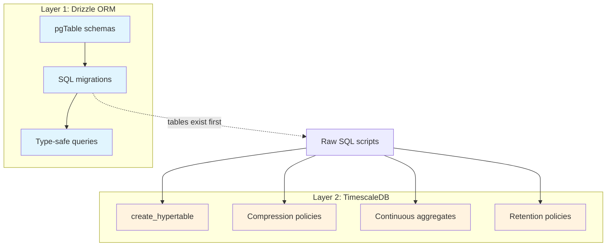

# The Two-Layer Trick: Drizzle ORM & TimescaleDB

I searched for a Drizzle TimescaleDB dialect. I searched npm, GitHub issues, community plugins. I tried extending the Postgres dialect, wrapping migration hooks, even considered forking Drizzle Kit's generator. None of it worked because none of it exists. Drizzle has no native TimescaleDB support — no `hypertable()` helper, no `compressionPolicy()` builder, no continuous aggregate type.

The instinct was to find one tool that handled everything. Schema definitions, type-safe queries, hypertable conversion, compression policies, continuous aggregates — all in one coherent system. That instinct was wrong. The actual answer is two tools, each doing one job. Drizzle manages the relational schema. Raw SQL manages TimescaleDB features. They share a database, not an abstraction.

This isn't a workaround. It's the correct architecture. Once I stopped fighting it, everything clicked.

## Layer 1: Drizzle owns the schema

Tables are defined as standard `pgTable()` with no TimescaleDB awareness:

```typescript
export const minuteBars = pgTable(
  'minute_bars',
  {
    symbol: text('symbol').notNull(),
    time: timestamp('time', { mode: 'date' }).notNull(),
    open: real('open').notNull(),
    high: real('high').notNull(),
    low: real('low').notNull(),
    close: real('close').notNull(),
    volume: bigint('volume', { mode: 'number' }).notNull(),
    vwap: real('vwap'),
    transactions: bigint('transactions', { mode: 'number' }),
  },
  (table) => ({
    pk: primaryKey({ columns: [table.symbol, table.time] }),
    timeIdx: index('minute_bars_time_idx').on(table.time),
  }),
);
```

This is 374 million rows of stock price data. Drizzle generates clean SQL migrations for it, gives type-safe insert/select/update, and tracks schema changes in a journal. That's what it's good at. The table definition says nothing about hypertables, chunk intervals, or compression — and that's the key insight. When TimescaleDB converts this table to a hypertable, the columns, indexes, and constraints all stay. Drizzle's view of the world remains accurate. The hypertable conversion is purely an internal storage optimization that the ORM never needs to know about.

## Layer 2: raw SQL owns TimescaleDB

After Drizzle creates the tables, a separate script converts them to hypertables. A config-driven pattern makes it idempotent — safe to run on every deploy, after every migration, during development:

```typescript
const HYPERTABLES: HypertableConfig[] = [
  { table: 'minute_bars',  timeColumn: 'time',       chunkInterval: '1 week' },
  { table: 'daily_bars',   timeColumn: 'time',       chunkInterval: '1 month' },
  { table: 'event_log',    timeColumn: 'event_time',  chunkInterval: '1 day' },
];

await sql`CREATE EXTENSION IF NOT EXISTS timescaledb CASCADE`;

for (const { table, timeColumn, chunkInterval } of HYPERTABLES) {
  await sql.unsafe(`
    SELECT create_hypertable(
      '${table}', '${timeColumn}',
      chunk_time_interval => INTERVAL '${chunkInterval}',
      if_not_exists => TRUE,
      migrate_data => TRUE
    )
  `);
}
```

`if_not_exists` makes re-running the script a no-op on already-converted tables. `migrate_data` moves existing rows into the correct chunks if the table has data — without it, `create_hypertable` fails on non-empty tables. This is also where compression policies, retention policies, and continuous aggregates would live. All raw SQL functions that Drizzle has no reason to know about. All idempotent. All in one script that runs after migrations.

## The three-step pipeline

The initialization order matters, and each step has a clear reason for existing independently:

```
pnpm run migrate           # 1. Apply Drizzle SQL migrations (standard DDL)
pnpm run setup:hypertables # 2. Convert tables, add TimescaleDB policies
pnpm run seed              # 3. Create admin user, insert reference data
```

In production, a separate Docker init container runs migrations before the API starts. The API container depends on the migration container completing successfully. This separation means Drizzle Kit generates and diffs migrations without ever encountering TimescaleDB SQL — which would produce nonsensical diffs on the next `generate` run.



Layer 1 creates the tables. Layer 2 adds time-series features. Application code only talks to Layer 1 for reads and writes — it doesn't know or care that the data is chunked, compressed, or subject to retention policies.

## Two details that save pain

**Lazy connections via Proxy.** If importing your database package opens a connection, every test file, every script, every module that transitively imports it is holding a connection open. A Proxy defers the connection to the first actual query:

```typescript
export const db = new Proxy({} as DbType, {
  get(_target, prop) {
    return (getDb() as Record<string | symbol, unknown>)[prop];
  },
});
```

Import freely. The connection opens only when you actually talk to the database. Tests that mock the database never connect. CLI tools that share types with the API don't need `DATABASE_URL` set.

**Strict mode in drizzle.config.ts.** Without `strict: true`, `drizzle-kit generate` prompts interactively to confirm destructive changes — which hangs forever in CI. Strict mode makes it fail loudly instead:

```typescript
export default defineConfig({
  schema: './src/schema/index.ts',
  out: './drizzle',
  dialect: 'postgresql',
  strict: true,
  dbCredentials: { url: process.env.DATABASE_URL! },
});
```

## The argument for two layers

The counterargument is obvious: isn't this just a workaround for a missing feature? If Drizzle had a TimescaleDB dialect, wouldn't that be better?

I don't think so. Hypertable conversion doesn't change the SQL interface. The same INSERT, SELECT, UPDATE, DELETE queries work identically before and after conversion. Compression and retention are operational policies, not schema concerns — they belong in infrastructure configuration, not in an ORM's migration journal. Continuous aggregates are derived views with their own refresh schedules. None of these things are schema in the way an ORM thinks about schema.

The separation is the design. Twenty-four Drizzle migrations, all standard PostgreSQL DDL. Zero TimescaleDB SQL in any of them. The ORM handles what ORMs handle. Infrastructure scripts handle infrastructure. They compose through a shared database, not through a shared abstraction. The moment I stopped trying to merge them, the system got simpler, more testable, and easier to reason about.

If you're reading this because you searched "drizzle timescaledb dialect" — you can stop searching. It doesn't exist, and you don't need it.

---

*TimescaleDB + Drizzle series:*
1. **The Two-Layer Trick** *(you are here)*
2. [Choosing Chunk Intervals](./02-choosing-chunk-intervals.md)
3. [Compression as Survival](./03-compression-as-survival.md)
4. [Continuous Aggregates](./04-continuous-aggregates.md)
5. [Bulk Ingestion](./05-bulk-ingestion.md)
6. [Query Patterns That Matter](./06-query-patterns-that-matter.md)
7. [Drizzle Migration Traps](./07-drizzle-migration-traps.md)
8. [The Things That Bite in Production](./08-production-lessons.md)
