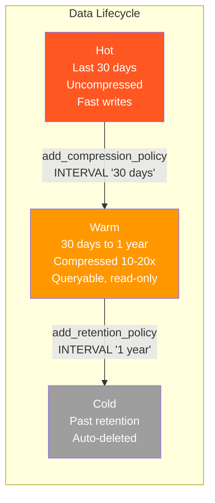

# Compression as Survival

I was importing historical options trade data — 1.3 billion rows of SPY and QQQ trades from flat files. The import script was working fine. Then the database died. The Docker volume was full. Not after hours of importing. After minutes. The uncompressed data was writing so fast that PostgreSQL's WAL files, temporary sort spills, and the raw row storage combined to exhaust a volume that had plenty of headroom for the compressed result. The comment in the compression service says it plainly: "Without compression, disk fills in <5 minutes for options trades."

That's when I understood that TimescaleDB compression isn't a performance optimization you circle back to later. It's a survival mechanism you wire into the ingestion pipeline on day one.

## The economics

Uncompressed options data: roughly 50GB per month. Compressed: 3-5GB per month. That's a 10-20x reduction. Financial time-series data compresses well because adjacent rows for the same symbol have similar prices, the same ticker string repeated thousands of times, and timestamps that increment predictably. TimescaleDB's columnar compression exploits all of this — it converts row-oriented storage into a columnar format and applies type-specific compression algorithms to each column.

## The two knobs

You need to tell TimescaleDB two things: what you filter by, and what you sort by.

```sql
ALTER TABLE minute_bars SET (
  timescaledb.compress,
  timescaledb.compress_segmentby = 'symbol',
  timescaledb.compress_orderby = 'time DESC'
);
```

`segmentby` is the column in your most common WHERE clause. For `minute_bars`, nearly every query includes `WHERE symbol = ?`. TimescaleDB groups compressed data by this column, so filtering stays fast after compression. `orderby` is the time direction — almost always `time DESC` because queries want the most recent data first. Get these right and reads against compressed chunks are often *faster* than uncompressed, because the columnar format means PostgreSQL reads less data off disk.

## The auto policy and its gap

For steady-state operation, the compression policy handles everything:

```sql
SELECT add_compression_policy('minute_bars', INTERVAL '30 days');
```

Chunks older than 30 days get compressed automatically by a background job. Recent data stays uncompressed for fast writes. This works perfectly for normal daily ingestion.

It does not work for backfills. The auto policy runs on a schedule — maybe every few hours. During a historical backfill, you're writing months of data in minutes. By the time the policy kicks in, your disk is already full. This is exactly what killed my first import attempt.

## Inline compression: the backfill fix

The import script compresses immediately after each day's data lands:

```typescript
for (const file of dataFiles) {
  const result = await processFile(file);

  // COMPRESS IMMEDIATELY after each day to prevent disk filling
  if (COMPRESS_AFTER) {
    const chunksCompressed = await compressAllChunks('options_minute_aggs');
    if (chunksCompressed > 0) {
      console.log(`  Compressed ${chunksCompressed} chunks`);
    }
  }
}
```

Ingest a day, compress it, move on. Disk usage stays flat because you're compressing as fast as you're writing. The backfill that killed a volume now completes comfortably.

The compression service that backs this has a few functions that get reused across the import scripts, nightly ingestion jobs, and health checks:

```typescript
compressChunksForDate(table, date)   // After each day's ingestion
compressAllChunks(table)              // Emergency cleanup
getStorageStatus(table)               // How many chunks compressed vs. not
verifyCompression(table)              // Throws if any chunks are uncompressed
```

That `verifyCompression` call is the safety net. It runs after every import batch and in CI. If any chunks outside the hot window are sitting uncompressed, it throws immediately rather than letting you discover the gap when a disk alert fires.

## Continuous aggregates are hypertables too

This caught me off guard. Continuous aggregates — the materialized views that TimescaleDB manages — are themselves hypertables. They accumulate chunks, and those chunks grow. I missed this for weeks. The base `minute_bars` table was beautifully compressed, while `spy_put_minute_cagg` (a minute-level options research aggregate) had quietly ballooned to 12GB. `spy_call_minute_cagg` hit 10GB. `hourly_bars` was at 8.5GB.

Same fix, one level up:

```sql
ALTER MATERIALIZED VIEW spy_put_minute_cagg SET (timescaledb.compress = true);
SELECT compress_chunk(c) FROM show_chunks('spy_put_minute_cagg') c
  WHERE c < now() - INTERVAL '7 days';
```

Twelve materialized views, all compressed with chunks older than seven days. Same columnar trick, same ratios.

## The data lifecycle

Compression fits into a broader pattern. Data has three phases, each with a TimescaleDB policy:



Hot data is the last 30 days — uncompressed, writable, serving real-time queries. Warm data is compressed 10-20x, still fully queryable, but effectively read-only. Cold data is past the retention window — `drop_chunks` deletes it automatically. My `event_log` table has a 30-day retention policy. `price_cache` has 3-day retention. `minute_bars` has no retention — historical price data is kept indefinitely, just compressed.

Three SQL statements give you a complete lifecycle that runs unattended. The disk usage graph is flat.

---

*TimescaleDB + Drizzle series:*
1. [The Two-Layer Trick](./01-the-two-layer-trick.md)
2. [Choosing Chunk Intervals](./02-choosing-chunk-intervals.md)
3. **Compression as Survival** *(you are here)*
4. [Continuous Aggregates](./04-continuous-aggregates.md)
5. [Bulk Ingestion](./05-bulk-ingestion.md)
6. [Query Patterns That Matter](./06-query-patterns-that-matter.md)
7. [Drizzle Migration Traps](./07-drizzle-migration-traps.md)
8. [The Things That Bite in Production](./08-production-lessons.md)
